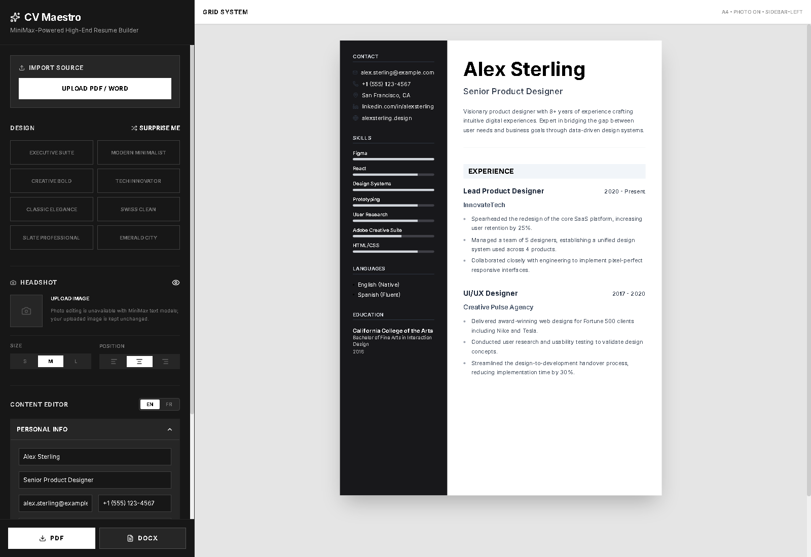

# CV Maestro

CV Maestro is a MiniMax-powered resume builder for turning existing CVs into
polished, editable, export-ready resumes.

> **Private live site:** [Open CV Maestro](https://cv-maestro-minimax.benclawbot.chatgpt.site)

## Features

- Import text-based PDF and DOCX resumes directly in the browser.
- Extract structured personal details, experience, education, skills, and custom sections with MiniMax M2.7.
- Rewrite summaries and experience bullets, or translate a resume between English and French.
- Choose from high-end templates, tune layout and headshot settings, and export PDF or ATS-compatible DOCX files.
- Keep the MiniMax API key server-side: the browser only calls the app's same-origin proxy.

## Run Locally

**Prerequisites:** Node.js 20+ and a MiniMax API key.

1. Install dependencies: `npm install`
2. Copy `.env.example` to `.dev.vars` and set `MINIMAX_API_KEY`.
3. Start the app: `npm run dev`
4. Open `http://localhost:3000`.

`MiniMax-M2.7` is the default model. The local development server and deployed
Site both proxy MiniMax calls, so the API key is never bundled into client-side
JavaScript.

## Import support

CV Maestro extracts text from PDF and DOCX files locally before sending only
that text to MiniMax for structuring. Scanned PDFs without selectable text are
not supported yet. Headshots are kept unchanged because MiniMax's text models
do not currently provide image editing in this workflow.

## Deployment

The project is configured for a private [ChatGPT Sites deployment](https://cv-maestro-minimax.benclawbot.chatgpt.site).
Set `MINIMAX_API_KEY` as a secret in the deployment runtime configuration; do
not add it to source control.
